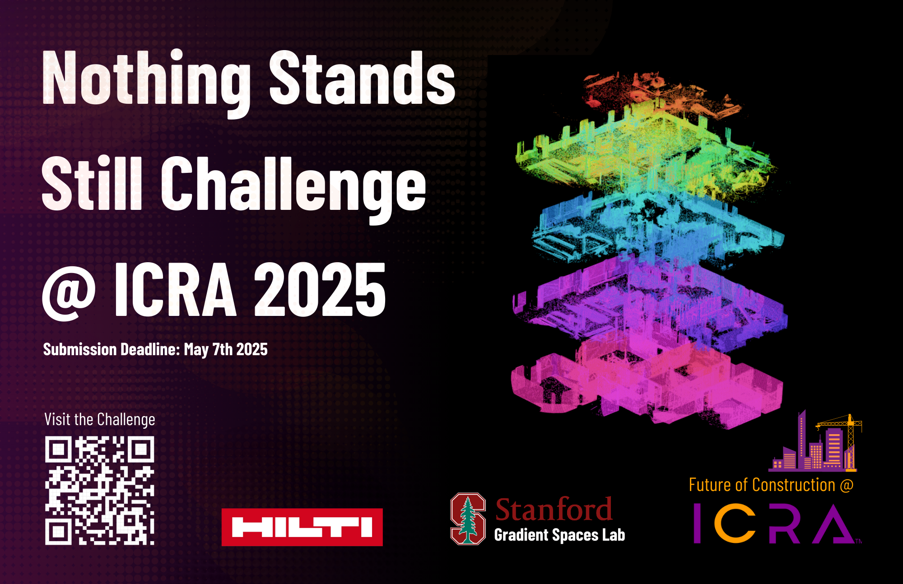

# Nothing Stands Still Challenge 2025

We, the <a href="https://gradientspaces.stanford.edu/">Gradient Spaces group</a> at Stanford University, together with <a href="https://hilti-challenge.com/index.html">HILTI</a>, are tackling the critical challenge of seamlessly integrating progress scans from various stages of construction toward accurate progress monitoring and prediction. To this end, we are bringing <a href="https://nothing-stands-still.com/">Nothing Stands Still</a> to the <a href="https://2024.ieee-icra.org/">2025 International Conference on Robotics and Automation (ICRA)</a>, and specifically as a challenge at the <a href="https://construction-robots.github.io/">4th Workshop on Future of Construction</a>.

The Nothing Stands Still Challenge 2025 targets the task of multiway spatiotemporal 3D point cloud registration of data collected over time at construction sites. For more details on the data, we refer to the <a href="https://nothing-stands-still.com/challenge#">"Nothing Stands Still: A spatiotemporal benchmark on 3D point cloud registration"</a> paper that contains all information about the dataset acquisition and curation, as well as on the benchmark associated with it.



## Usage

### Pre-requisites
Please make sure you have the following packages installed:

- Python 3.8 or later
- Open3D 0.9.0 or later
- NumPy 1.20.0 or later
- Sklearn 0.22.0 or later

### Evaluation
To evaluate your results, you can use the provided evaluation script `evaluate_registration.py`. The script takes two required arguments: the path to the ground truth JSON file and the path to the prediction JSON file. 

```shell
python -m nss_challenge.evaluate_registration \
    "/path/to/ground_truth.json" \
    "/path/to/prediction.json" \
    --point_cloud_dir "/dir/to/pointclouds"
```

The optional argument `--point_clouds_dir` specifies the directory where the point clouds are stored. This is required if you want to compute the RMSE metrics. Note that this may take a longer time to compute.

### Output

You can expect the following output for the overall evaluation of all scenes:
```
Overall                                 All            Same-Stage     Cross-Stage    
-------------------------------------------------------------------------------------
Pairwise RMSE [m]                       0.310          0.167          0.995          
F1 Outlier Detection [%]                23.304         46.812         13.534
Average Translation Error [m]           0.181          0.084          0.760          
Average Rotation Error [deg]            5.231          2.139          9.135      
```

There will also be tables showing the same metrics for each scene.


## Evaluation Protocol
The goal of the challenge is to achieve a global spatiotemporal map of 3D fragments collected at any time and location at the same construction scenes, as the latter evolve. Participants will be evaluated on the cross-area split of the Nothing Stands Still dataset for the multiway registration task and particularly on the metric of Global Root Mean Squared Error (RMSE) of each scene, which we will use to select the winner. This new data split is designed to evaluate the generalization capabilities of the algorithms to unseen areas. In addition, a secondary task of outlier detection will be used to evaluate robustness of the algorithms. The winner and the first runner up will receive a cash prize (4K USD and 1K USD respectively). Everybody is welcome to participate in the challenge, however only students (undergrad, postgrad) are eligible for receiving the cash prizes. Below, we provide the details of Global RMSE and other metrics used for evaluating algorithmic behavior.

<table>
  <tr>
    <th>Metric</th>
    <th>Unit</th>
    <th>Description</th>
  <tr>
    <td>Global RMSE</td>
    <td>Meters</td>
    <td>Measures the Root Mean Squared Error (RMSE) across all fragments in the global coordinate system, calculating the distance between ground truth points and their closest points in the estimation of aligned fragments. This is the main metric that determines the winner of the challenge.</td>
  </tr>
  <tr>
    <td>Outlier Detection F1 Score</td>
    <td>Percentage</td>
    <td>Measures how accurately participants detect outlier nodes.</td>
  </tr>
  <tr>
    <td>Average Translation Error</td>
    <td>Meters</td>
    <td>The averaged translation error for the estimated transformation of each fragment pair in the scene.</td>
  </tr>
  <tr>
    <td>Average Rotation Error</td>
    <td>Degrees</td>
    <td>The averaged rotation error in degrees for the estimated transformation of each fragment pair in the scene.</td>
  </tr>
</table>
		
For more details on the metrics and evaluation, we refer to Section 5 of the "Nothing Stands Still: A spatiotemporal benchmark on 3D point cloud registration" paper.


## Dataset
The data of this challenge is the set of raw 3D fragments and their corresponding temporal stamps. Since there is no odometry information due to the way the dataset was collected, in lieu of that we provide participants with a graph structure, where nodes represent the spatiotemporal fragments and edges denote spatial overlap. We will be referring to them as "odometry" graphs. The test set for the challenge is hidden and evaluation on it is hosted on our evaluation server. For the training and validation sets, we provide all ground truth information.

In this Github repository we provide the evaluation code and metrics for the multiway registration task. In addition to the main and defining metric of global pose error (RMSE), we also provide participants an evaluation on the rest of the metrics describted above, so as to furhter analyze the behavior of their algorithm.


### Download the Dataset
A new sampling of the NSS dataset is provided for non-commercial research purposes (no R&D) and can be downloaded from here. Note both the data and benchmark are different from the 2024 NSS Challenge, to participate in this year's challenge only this year's data is relevant:
<ul>
  <li> pointclouds.zip:         contains the 3D fragments</li>
  <li> pose_graphs.zip:         annotations for multiway registration</li>
  <li> visualizations.zip:         shows the relevant area</li>
  <li> nss_challenge_readme.md:         information on the challenge and data structure</li>
</ul>
Note that there is a difference between annotation.zip and annotation_multiway.zip, so make sure you download the appropriate files.

### Data Evaluation
Data evaluation will be hosted on our <a href="https://eval.nothing-stands-still.com/">evaluation server</a>. Users will be able to submit their results in a specific format and get the results back once processed. Note that this server is used to collect submissions, please use the NSS challenge repo for evaluation during development. Details on the submission format and evaluation can be found on our evaluation server.


### Format
Folder structure for the NSS Challenge 2025:

```yaml
- challenge_2025
  - point_cloud                             # Point cloud data for all splits.
    - Bldg1_Stage1_Spot0.ply
    - Bldg1_Stage1_Spot1.ply
    - ...

  - pose_graph                  
    - train
      - Bldg1_Graph1.json
      - Bldg1_Graph2.json
      - ...
    - val
    - test

  - visualization                           # Visualization of each pose graph in train and val.
    - train
        - Bldg1_Graph1.png
        - Bldg1_Graph2.png
        - ...
    - val
```

Pose Graph Format:

```python
{
  "name": "Bldg1_Graph3",                   
  "size": 20,                               # Number of nodes in the graph.               
  "nodes": [                               
    {
      "id": 0,                              # Node ID.                            
      "name": "Bldg1_Stage3_Spot495.ply",   # Point cloud file in the point_cloud/ folder.
      "building": 1,                        # Building ID.
      "stage": 3,                           # Stage ID.                    
      "spot": 495,                          # Spot ID.                    
      "points": 28277,                      # Number of points in the point cloud.
      "global_transform": [                 # Global transformation matrix (4 by 4) that transforms the point cloud to the world frame.
        [1, 0, 0, 0],                       # NOTE: For the outlier point clouds, the global transformation matrix is the zero matrix.
        [0, 1, 0, 0],
        [0, 0, 1, 0],
        [0, 0, 0, 1]
      ],                                    
    },
    ...
  ],

  "edges": [                                # List of edges in the graph, only provided for the train and val splits.
    {
      "source_id": 2,                       # Node ID of the source point cloud. 
      "target_id": 12,                      # Node ID of the target point cloud.
      "relative_transform": [               # Relative transformation matrix (4 by 4) that transforms the source point cloud to the target.
        [1, 0, 0, 0],
        [0, 1, 0, 0],
        [0, 0, 1, 0],
        [0, 0, 0, 1]
      ],
    "overlap_ratio": 0.618                  # Overlap ratio between the source and target point clouds.
    "same_stage": true                      # Whether the source and target point clouds are in the same temporal stage.
  },
    ...
 ]
}
```

### Notes
1. Each point cloud is downsampling to 0.075m voxel size.
2. 4 random graph sizes: [20, 40, 80, 160], 
3. Each graph is added up to 10% outlier nodes, which are disconnected to all inlier nodes and among themselves.
In the submission, the participants are required to also detect the outlier nodes by leaving the "global_transform" to the zero matrix.
4. Each inlier node has degree >= 2 (meaning that it must connect to at least two other positive nodes in the graph).
5. Average overlap ratio for each graph is guaranteed to be > 0.3, and the minimum overlap > 0.1 for all edges.
6. Quantity: 200 pose graphs per building, except for Building 4 (100 graphs).
7. Data split same as the 'Cross-Area' split in the NSS paper:
	- Building [1, 2, 6] for training,
	- Building [3] for validation,
  	- Building [4, 5] for testing.

  
## Organizers
<table border="0" width="100%">
	<tr border="0">
		<td width="20%" border="0"></td>
		<td width="20%" border="0"></td>
		<td width="20%" border="0"></td>
		<td width="20%" border="0"></td>
		<td width="20%" border="0"></td>
	</tr>
 	<tr border="0">
		<td width="20%" border="0" text-align="center">Tao Sun</td>
		<td width="20%" border="0" text-align="center">Emily Steiner</td>
		<td width="20%" border="0" text-align="center">Torben Gräber</td>
		<td width="20%" border="0" text-align="center">Michael Helmberger</td>
		<td width="20%" border="0" text-align="center">Iro Armeni</td>
  	</tr>
   	<tr>
		<td width="20%" border="0" text-align="center">Stanford University</td>
		<td width="20%" border="0" text-align="center">Stanford University</td>
		<td width="20%" border="0" text-align="center">HILTI Group</td>
		<td width="20%" border="0" text-align="center">HILTI Group</td>
		<td width="20%" border="0" text-align="center">Stanford University</td>
  	</tr>
</table>
