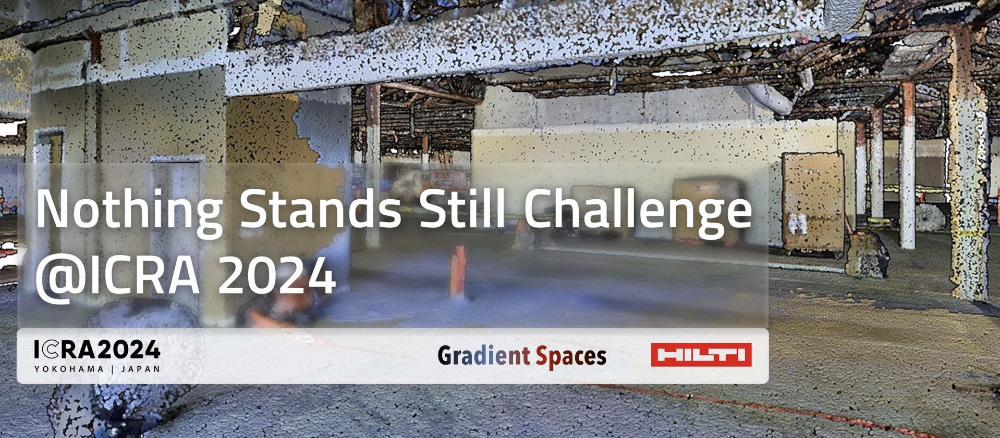

# Nothing Stands Still Challenge 2024

We, the <a href="https://gradientspaces.stanford.edu/">Gradient Spaces group</a> at Stanford University, together with <a href="https://hilti-challenge.com/index.html">HILTI</a>, are tackling the critical challenge of seamlessly integrating progress scans from various stages of construction toward accurate progress monitoring and prediction. To this end, we are bringing <a href="https://nothing-stands-still.com/">Nothing Stands Still</a> to the <a href="https://2024.ieee-icra.org/">2024 International Conference on Robotics and Automation (ICRA)</a>, and specifically as a challenge at the <a href="https://construction-robots.github.io/">3rd Workshop on Future of Construction</a>.

The Nothing Stands Still Challenge 2024 targets the task of multiway spatiotemporal 3D point cloud registration of data collected over time at construction sites. For more details on the data, we refer to the <a href="https://nothing-stands-still.com/challenge#">"Nothing Stands Still: A spatiotemporal benchmark on 3D point cloud registration"</a> paper that contains all information about the dataset acquisition and curation, as well as on the benchmark associated with it.



## Usage

### Pre-requisites
Please make sure you have the following packages installed:

- Python 3.8 or later
- Open3D 0.9.0 or later
- NumPy 1.20.0 or later
- Sklearn 0.22.0 or later

### Evaluation
To evaluate your results, you can use the provided evaluation script `evaluate_registration.py`. The script takes two required arguments: the path to the ground truth JSON file and the path to the prediction JSON file. 

```shell
python -m nss_challenge.evaluate_registration \
    "/path/to/ground_truth.json" \
    "/path/to/prediction.json" \
    --point_cloud_dir "/dir/to/pointclouds"
```

The optional argument `--point_clouds_dir` specifies the directory where the point clouds are stored. This is required if you want to compute the RMSE metrics. Note that this may take a longer time to compute.

### Output

You can expect the following output for the overall evaluation of all scenes:
```
Overall                                 All            Same-Stage     Cross-Stage    
-------------------------------------------------------------------------------------
Pairwise RMSE [m]                       0.310          0.167          0.995          
Registration Recall [%]                 23.304         46.812         13.534
Average Translation Error [m]           0.181          0.084          0.760          
Average Rotation Error [deg]            5.231          2.139          9.135      
```

There will also be tables showing the same metrics for each scene.


## Evaluation Protocol
The goal of the challenge is to achieve a global spatiotemporal map of 3D fragments collected at any time and location at the same construction scenes, as the latter evolve. Participants will be evaluated on the original split of the Nothing Stands Still dataset for the multiway registration task and particularly on the metric of Global Root Mean Squared Error (RMSE) of each scene, which we will use to select the winner. The winner and the first runner up will receive a cash prize (4K CHF and 1K CHF respectively). Everybody is welcome to participate in the challenge, however only students (undergrad, postgrad) are eligible for receiving the cash prizes. Below, we provide the details of Global RMSE and other metrics used for evaluating algorithmic behavior.

<table>
  <tr>
    <th>Metric</th>
    <th>Unit</th>
    <th>Description</th>
  <tr>
    <td>Global RMSE</td>
    <td>Meters</td>
    <td>Measures the Root Mean Squared Error (RMSE) across all fragments in the global coordinate system, calculating the distance between ground truth points and their closest points in the estimation of aligned fragments. This is the main metric that determines the winner of the challenge.</td>
  </tr>
  <tr>
    <td>Pairwise RMSE</td>
    <td>Meters</td>
    <td>Measures the RMSE for each pair of fragments in the scene, between ground truth points and their closest points in the estimation of aligned fragment, averaged across all pairs.</td>
  </tr>
  <tr>
    <td>Registration Recall</td>
    <td>Percentage</td>
    <td>The proportion of fragment pairs in the scene for which the estimated transformation closely matches the ground truth, within a predefined threshold.</td>
  </tr>
  <tr>
    <td>Average Translation Error</td>
    <td>Meters</td>
    <td>The averaged translation error for the estimated transformation of each fragment pair in the scene.</td>
  </tr>
  <tr>
    <td>Average Rotation Error</td>
    <td>Degrees</td>
    <td>The averaged rotation error in degrees for the estimated transformation of each fragment pair in the scene.</td>
  </tr>
</table>
		
The threshold for the registration recall metric is set to 0.1 meters for the translation error and 10 degrees for the rotation error. For more details on the metrics and evaluation, we refer to Section 5 of the "Nothing Stands Still: A spatiotemporal benchmark on 3D point cloud registration" paper.


## Dataset
The data of this challenge is the set of raw 3D fragments and their cooresponding temporal stamps. Since there is no odometry information due to the way the dataset was collected, in lieu of that we provide participants with a graph structure, where nodes represent the spatiotemporal fragments and edges denote spatial overlap. We will be referring to them as "odometry" graphs. The test set for the challenge is hidden and evaluation on it is hosted on our evaluation server (we will update the link soon). For the training and validation sets, we provide all ground truth information.

In this Github repository we provide the evaluation code and metrics for the multiway registration task. In addition to the main and defining metric of global pose error (RMSE), we also provide participants an evaluation on the rest of the metrics describted above, so as to furhter analyze the behavior of their algorithm.


### Download the Dataset
The NSS dataset is provided for non-commercial research purposes (no R&D) and can be downloaded from here. Relevant data to download are:
<ul>
  <li> pointclouds.zip:         contains the 3D fragments</li>
  <li> multiway_graphs.zip:     contains the "odometry" graphs</li>
  <li> annotation_multiway.zip: only the original folder is relevant (ignore other folders)</li>
</ul>
Note that there is a difference between annotation.zip and annotation_multiway.zip, so make sure you download the appropriate files.

### Data Evaluation
Data evaluation will be hosted on our <a href="https://eval.nothing-stands-still.com/">evaluation server</a>. Users will be able to submit their results in a specific format and get the results back in a few minutes (details on the format will be updated soon).


### Format
We use JSON files defining the pose graphs for global and pairwise point cloud
registration evaluations. Each JSON file contains a list of pose graphs, each
representing a specific building scene.

```
- list[dict]:                       List of pose graphs.

  - name (str):                     Name for the building scene, formatted as "BldgX_SceneN".

  - nodes (list[dict]):             List of nodes representing point clouds within the scene.
    - id (int):                     Identifier (ID) for the node within its scene.
    - name (str):                   Name of the point cloud file, formatted as "BldgX_StageY_SpotZ.ply".
    - tsfm (list[list[float]]):     4x4 transformation matrix of the pose of the point cloud in global coordinates.
    - building (str):               Building name, matching "X" in the node name.
    - stage (str):                  Temporal stage, matching "Y" in the node name.
    - spot (str):                   Spot number,  matching "Z" in the node name.
    - points (int):                 Number of points in the point cloud.
    - anchor (bool, optional):      Indicates whether the node is an anchor node. Default is False. Only used in prediction file.

  - edges (list[dict], optional):   List of edges representing pairwise relationships between nodes. Each edge is a dictionary:
    - source (int):                 Node ID of the source point cloud.
    - target (int):                 Node ID of the target point cloud.
    - tsfm (list[list[float]]):     4x4 transformation matrix of the relative pose from the source to the target.
    - overlap (float):              Overlap ratio between the source and target, ranging from 0.0 to 1.0.
    - temporal_change (float):      Temporal change ratio indicating the amount of temporal change between the source and target, ranging from 0.0 to 1.0.
    - same_stage (bool):            Indicates whether the source and target come from the same temporal stage.
```

### Notes
- The transformation matrix is in the format of a 4x4 matrix, where the top-left 3x3 submatrix is the rotation matrix and the top-right 3x1 submatrix is the translation vector.
- In the submission, only the `id`, `tsfm` fields in the nodes and `source`, `target`, `tsfm` fields in edges are considered.
- For pairwise pose evaluation, metrics are computed over the defined edges. If `edges`
  are missing or partially missing in the prediction files, the missing parts will be 
  computed using the nodes' global poses.
- For global pose evaluation, only the transformation in the `nodes` is considered. 
- **Update (10/03/2024)**: For global pose evaluation, the anchor node will be the first node in the prediction nodes list of each scene. If you want to use a different anchor node, please set the `anchor` field to `True`` in the corresponding node.

For more details, please refer to the challenge website:
https://nothing-stands-still.com/challenge

  
## Organizers
<table border="0" width="100%">
	<tr border="0">
		<td width="20%" border="0"></td>
		<td width="20%" border="0"></td>
		<td width="20%" border="0"></td>
		<td width="20%" border="0"></td>
		<td width="20%" border="0"></td>
	</tr>
 	<tr border="0">
		<td width="20%" border="0" text-align="center">Tao Sun</td>
		<td width="20%" border="0" text-align="center">Yan Hao</td>
		<td width="20%" border="0" text-align="center">Shengyu Huang</td>
		<td width="20%" border="0" text-align="center">Michael Helmberger</td>
		<td width="20%" border="0" text-align="center">Iro Armeni</td>
  	</tr>
   	<tr>
		<td width="20%" border="0" text-align="center">ETH Zurich</td>
		<td width="20%" border="0" text-align="center">ETH Zurich</td>
		<td width="20%" border="0" text-align="center">ETH Zurich</td>
		<td width="20%" border="0" text-align="center">HILTI Group</td>
		<td width="20%" border="0" text-align="center">Stanford University</td>
  	</tr>
</table>
