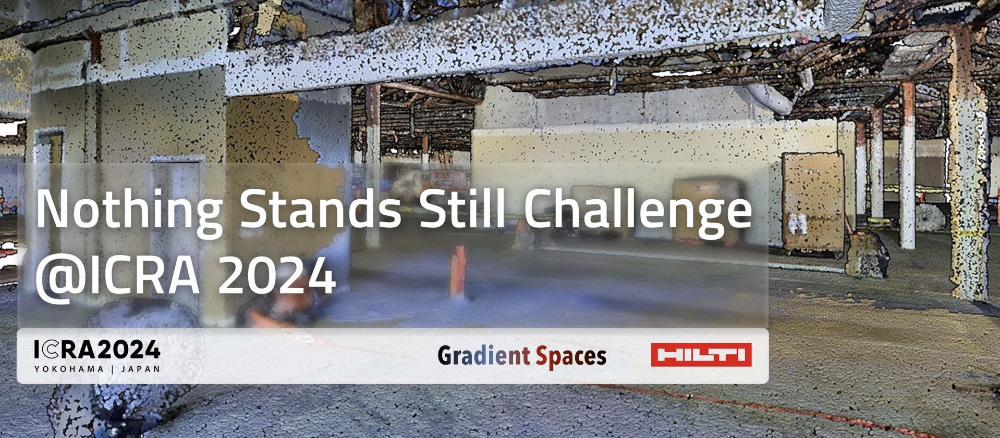

# Nothing Stands Still Challenge 2024

We, the <a href="https://gradientspaces.stanford.edu/">Gradient Spaces group</a> at Stanford University, together with <a href="https://hilti-challenge.com/index.html">HILTI</a>, are tackling the critical challenge of seamlessly integrating progress scans from various stages of construction toward accurate progress monitoring and prediction. To this end, we are bringing <a href="https://nothing-stands-still.com/">Nothing Stands Still</a> to the <a href="https://2024.ieee-icra.org/">2024 International Conference on Robotics and Automation (ICRA)</a>, and specifically as a challenge at the <a href="https://construction-robots.github.io/">3rd Workshop on Future of Construction</a>.

The Nothing Stands Still Challenge 2024 targets the task of multiway spatiotemporal 3D point cloud registration of data collected over time at construction sites. For more details on the data, we refer to the <a href="https://nothing-stands-still.com/challenge#">"Nothing Stands Still: A spatiotemporal benchmark on 3D point cloud registration"</a> paper that contains all information about the dataset acquisition and curation, as well as on the benchmark associated with it.

## Evaluation Protocol
The goal of the challenge is to achieve a global spatiotemporal map of 3D fragments collected at any time and location at the same construction scenes, as the latter evolve. Participants will be evaluated on the original split of the Nothing Stands Still dataset for the multiway registration task and particularly on the metric of Global Root Mean Squared Error (RMSE) of each scene, which we will use to select the winner. The winner and the first runner up will receive a cash prize (4K CHF and 1K CHF respectively). Everybody is welcome to participate in the challenge, however only students (undergrad, postgrad) are eligible for receiving the cash prizes. Below, we provide the details of Global RMSE and other metrics used for evaluating algorithmic behavior.

<b>METRIC	UNIT	DESCRIPTION</b>
<table>
  <tr>
    <td>Global RMSE</td>
    <td>Meters</td>
    <td>Measures the Root Mean Squared Error (RMSE) across all fragments in the global coordinate system, calculating the distance between ground truth points and their closest points in the estimation of aligned fragments. This is the main metric that determines the winner of the challenge.</td>
  </tr>
  <tr>
    <td>Pairwise RMSE</td>
    <td>Meters</td>
    <td>Measures the RMSE for each pair of fragments in the scene, between ground truth points and their closest points in the estimation of aligned fragment, averaged across all pairs.</td>
  </tr>
  <tr>
    <td>Registration Recall</td>
    <td>Percentage</td>
    <td>The proportion of fragment pairs in the scene for which the estimated transformation closely matches the ground truth, within a predefined threshold.</td>
  </tr>
  <tr>
    <td>Average Translation Error</td>
    <td>Meters</td>
    <td>The averaged translation error for the estimated transformation of each fragment pair in the scene.</td>
  </tr>
  <tr>
    <td>Average Rotation Error</td>
    <td>Degrees</td>
    <td>The averaged rotation error in degrees for the estimated transformation of each fragment pair in the scene.</td>
  </tr>
</table>
		
The threshold for the registration recall metric is set to 0.1 meters for the translation error and 10 degrees for the rotation error. For more details on the metrics and evaluation, we refer to Section 5 of the "Nothing Stands Still: A spatiotemporal benchmark on 3D point cloud registration" paper.

## Dataset
The data of this challenge is the set of raw 3D fragments and their cooresponding temporal stamps. Since there is no odometry information due to the way the dataset was collected, in lieu of that we provide participants with a graph structure, where nodes represent the spatiotemporal fragments and edges denote spatial overlap. We will be referring to them as "odometry" graphs. The test set for the challenge is hidden and evaluation on it is hosted on our evaluation server (we will update the link soon). For the training and validation sets, we provide all ground truth information.

In this Github repository we provide the evaluation code and metrics for the multiway registration task. In addition to the main and defining metric of global pose error (RMSE), we also provide participants an evaluation on the rest of the metrics describted above, so as to furhter analyze the behavior of their algorithm.

### Download the Dataset
The NSS dataset is provided for non-commercial research purposes (no R&D) and can be downloaded from here. Relevant data to download are:
<ul>
  <li> pointclouds.zip:         contains the 3D fragments</li>
  <li> multiway_graphs.zip:     contains the "odometry" graphs</li>
  <li> annotation_multiway.zip: only the original folder is relevant (ignore other folders)</li>
</ul>
Note that there is a difference between annotation.zip and annotation_multiway.zip, so make sure you download the appropriate files.

### Data Evaluation
Data evaluation will be hosted on our <a href="https://eval.nothing-stands-still.com/">evaluation server</a>. Users will be able to submit their results in a specific format and get the results back in a few minutes (details on the format will be updated soon).

## Organizers
<table>
	<tr>
		<td></td>
		<td>
		<td>
		<td>
		<td></td>
	</tr>
	<tr>
		<td>Tao Sun</td>
		<td>Yan Hao</td>
		<td>Shengyu Huang</td>
		<td>Michael Helmberger</td>
		<td>Iro Armeni</td>
	</tr>
 	<tr>
		<td>ETH Zurich</td>
		<td>ETH Zurich</td>
		<td>ETH Zurich</td>
		<td>HILTI Group</td>
		<td>Stanfod University</td>
	</tr>
</table>
